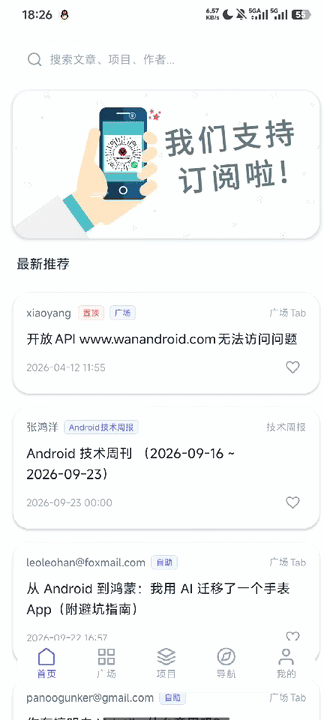

# WanAndroid Kotlin Client

基于 WanAndroid 开放 API 开发的 Kotlin Android 客户端，采用 MVVM 架构，完整实现首页、广场、项目、导航、体系、搜索、收藏及用户模块，重点实践 StateFlow 状态管理、网络层封装、登录态持久化、分页加载与复杂页面交互。

## 📱 项目展示

  

## 🎬 演示视频

https://github.com/user-attachments/assets/cd060fa3-c425-4317-85d9-29e302e3105a

## ✨ 项目特点

- 基于 MVVM 架构，使用 StateFlow 驱动 UI 状态更新
- 对 Retrofit 网络请求结果进行统一封装，统一处理 Loading / Success / Error 状态
- 基于 OkHttp Cookie 持久化实现登录状态保持
- 使用 Navigation Component 管理 Fragment 页面跳转与 ViewModel 共享
- 首页实现 Banner 自动轮播、置顶文章、分页加载与下拉刷新
- 导航模块实现左侧目录与右侧内容联动
- 对 WebView 内部链接跳转和返回栈进行统一处理

## 架构设计

项目采用 Single Activity + 多 Fragment 架构。

## 技术栈

- Language: Kotlin
- Architecture: MVVM + ViewModel + StateFlow
- Network: Retrofit + OkHttp
- UI: XML + ViewBinding + RecyclerView + ViewPager2
- Navigation: Navigation Component + BottomNavigationView
- Image: Coil
- Persistence: SharedPreferences

## 功能模块

- 首页：Banner、置顶文章、文章列表、刷新、加载更多、收藏
- 广场：用户分享文章、分享文章、刷新、加载更多
- 项目：项目分类、最新项目、项目卡片、图片加载
- 导航：导航/体系双 Tab、左右联动、标签流
- 我的：登录、注册、用户信息、我的收藏、我的分享、退出登录
- 搜索：热搜词、关键词搜索、搜索结果分页
- WebView：文章详情、内部链接处理、返回栈处理
